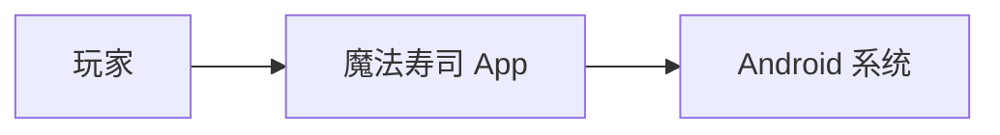
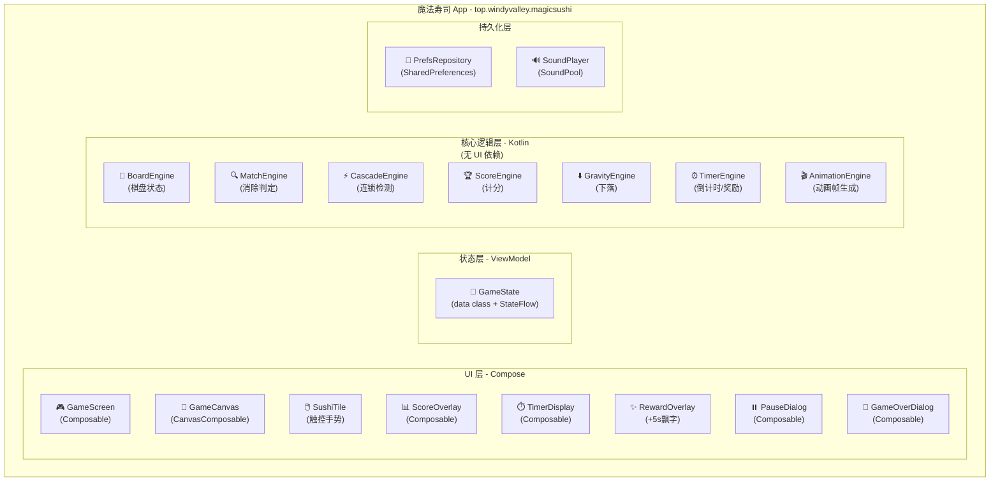
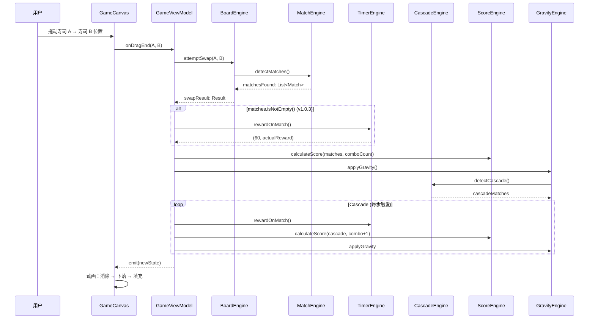
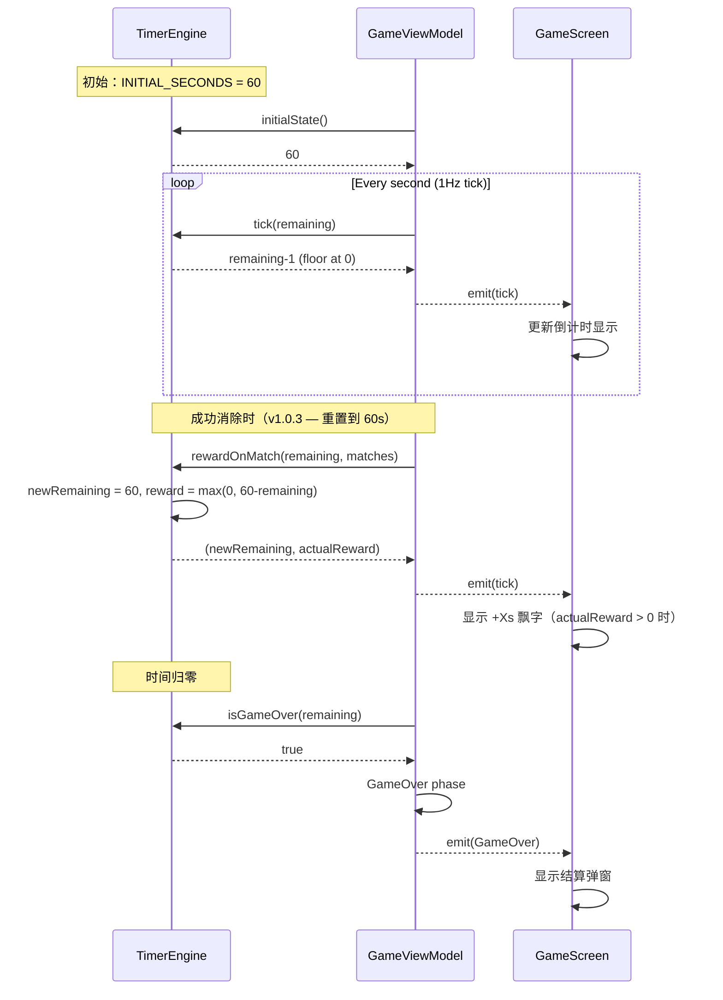
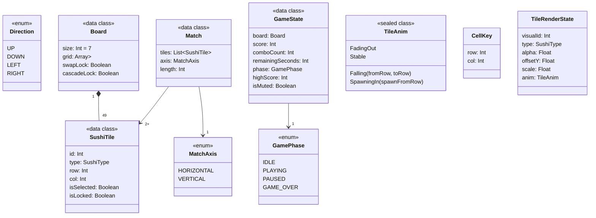

# Magic Sushi 架构图

> C4 Model 三层视图。对应 02-design.md §3

---

## Level 1: Context（系统上下文）



**说明：**
- 玩家打开 App → 直接进入游戏棋盘
- App 完全运行在 Android 系统上，**无需网络**
- 无服务端、无第三方服务

---

## Level 2: Container（容器视图）



**说明：**
- **UI 层**：100% Compose，不含任何 Android View
- **状态层**：Jetpack ViewModel + StateFlow
- **核心逻辑层**：纯 Kotlin 业务逻辑，**无任何 Compose/Android 依赖**，可独立单元测试
- **持久化层**：SharedPreferences，仅存最高分

---

## Level 3: Component - 核心交互时序

### 3.1 交换 → 消除 → 连锁完整流程



### 3.2 倒计时流程（含 v1.0.3 奖励机制）



---

## Level 4: 棋盘数据结构



**Direction vs MatchAxis 说明（2026-06-20 13:47 决策）：**
- `Direction`（cardinal，4 值）：用于交换手势、重力下落
- `MatchAxis`（axial，2 值）：用于 Match 检测出的轴线方向
- 两者独立，不能合并（从 v1 → v2 的冲突修复）

---

## 棋盘 7×7 网格坐标示意

```
     col: 0   1   2   3   4   5   6
        ┌───┬───┬───┬───┬───┬───┬───┐
  row:0 │ 🍣│ 🍙│ 🍣│ 🍣│ 🍙│ 🍣│ 🍙│
        ├───┼───┼───┼───┼───┼───┼───┤
  row:1 │ 🍙│ 🍣│ 🍙│ 🍣│ 🍙│ 🍣│ 🍙│
        ├───┼───┼───┼───┼───┼───┼───┤
  row:2 │ 🍣│ 🍙│ 🍣│ 🍙│ 🍣│ 🍙│ 🍣│
        ├───┼───┼───┼───┼───┼───┼───┤
  row:3 │ 🍙│ 🍣│ 🍣│ 🍙│ 🍣│ 🍙│ 🍣│
        ├───┼───┼───┼───┼───┼───┼───┤
  row:4 │ 🍣│ 🍙│ 🍣│ 🍙│ 🍣│ 🍣│ 🍙│
        ├───┼───┼───┼───┼───┼───┼───┤
  row:5 │ 🍙│ 🍣│ 🍙│ 🍣│ 🍙│ 🍣│ 🍙│
        ├───┼───┼───┼───┼───┼───┼───┤
  row:6 │ 🍣│ 🍙│ 🍣│ 🍙│ 🍣│ 🍙│ 🍣│
        └───┴───┴───┴───┴───┴───┴───┘

  交换相邻: (row,col) ↔ (row±1,col) 或 (row,col±1)
  消除判定: 横→ row 相同, col 连续3+ | 竖→ col 相同, row 连续3+
```

---

## 核心模块职责

| 模块 | 职责 | 对应类 |
|------|------|-------|
| 棋盘状态 | 管理 7×7 网格、寿司放置、交换 | `BoardEngine` |
| 消除判定 | 检测横/竖三连、L/T 形 | `MatchEngine` |
| 连锁 | 递归检测下落后的新三连 | `CascadeEngine` |
| 下落 | 重力填充空位 | `GravityEngine` |
| 计分 | 基础分 + combo 加成 + 连击加成 | `ScoreEngine` |
| 渲染 | Canvas 绘制棋盘 + 动画 | `GameCanvas` (CanvasComposable) |
| 状态VM | UI 状态 + 协调核心层 | `GameViewModel` |

**核心层（无 UI 依赖）**：`BoardEngine` / `MatchEngine` / `CascadeEngine` / `ScoreEngine` / `GravityEngine`
**UI 层**：Compose + Canvas