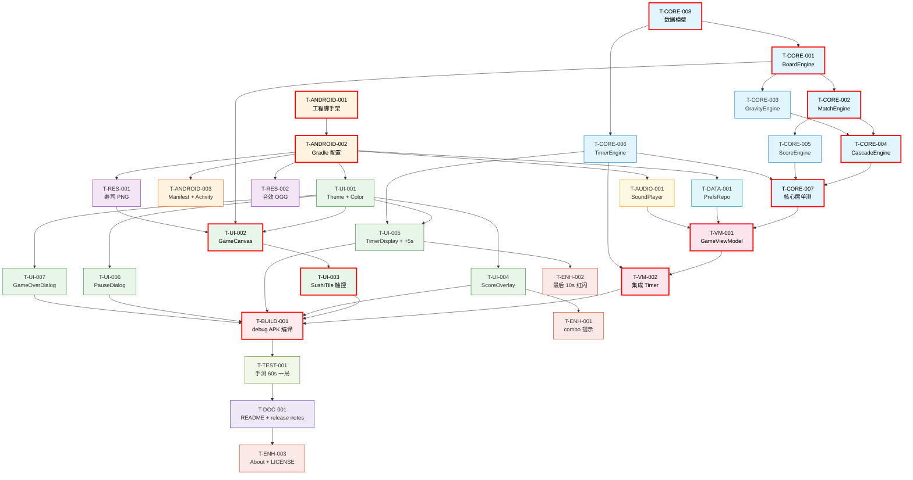

# Magic Sushi 任务依赖图

> **追溯：** eng-decompose skill 输出
> **输入：** `03-decomposition.md`
> **图规则：** 优先 Mermaid（按 eng-design v2）

---

## 1. 完整依赖图（Mermaid）



## 2. 关键路径（最长串行链）

```
T-CORE-008 (Models) ──→ T-CORE-001 (Board) ──→ T-CORE-002 (Match) ──→
T-CORE-004 (Cascade) ──→ T-CORE-007 (Tests) ──→
T-ANDROID-001 ──→ T-ANDROID-002 ──→
T-UI-002 (Canvas) ──→ T-UI-003 (触控) ──→
T-VM-001 (ViewModel) ──→ T-VM-002 (Timer) ──→
T-BUILD-001 (APK)

总链长：13 个任务 / 约 50h
```

## 3. 并行分组（实际串行执行，但识别为独立）

| 组 | 任务 | 关系 |
|----|------|------|
| **A** | T-CORE-002, T-CORE-003 | 都需要 T-CORE-001，互不依赖 |
| **B** | T-CORE-006 (Timer) | 只需 T-CORE-008，与核心层其它独立 |
| **C** | T-RES-001, T-RES-002 | 资源下载，互相独立 |
| **D** | T-UI-004, T-UI-005, T-UI-006, T-UI-007 | 都需要 T-UI-001，互相独立 |
| **E** | T-ANDROID-002 → 4 个下游 | T-ANDROID-002 完成后 T-UI-001/T-DATA-001/T-AUDIO-001 可并行 |

## 4. 图例

| 颜色 | 类别 |
|------|------|
| 🔵 蓝 | core（核心逻辑层） |
| 🟠 橙 | android（Android 工程） |
| 🟣 紫 | res（资源） |
| 🟢 绿 | ui（UI 层） |
| 🌸 粉 | vm（ViewModel） |
| 🩵 青 | data（数据） |
| 🟡 黄 | audio（音效） |
| 🔴 红 | build（构建） |
| 🟢 浅绿 | test（测试） |
| 🟪 深紫 | doc（文档） |
| 🟥 红边 | 关键路径（红色描边） |

## 5. 节点状态

- ⚪ todo（待开始）
- 🟡 in_progress（进行中）
- ✅ done（完成）
- 🔴 blocked（阻塞）

> 状态由 eng-dev 阶段维护，每个 T-*.md 文件的 frontmatter 标注。
> 本图渲染时按状态着色（todo=灰 / in_progress=黄 / done=绿 / blocked=红）。

## 6. 下一步

本图用于 eng-dev 阶段：
1. 按关键路径顺序开发
2. 完成一个 T-*.md 状态 → ⚪ → 🟡 → ✅
3. 阻塞立即登记到 `PROJECT_STATUS.md` Blockers 区块
4. eng-dev 完成后本图全 ✅ → 进入 eng-test-plan